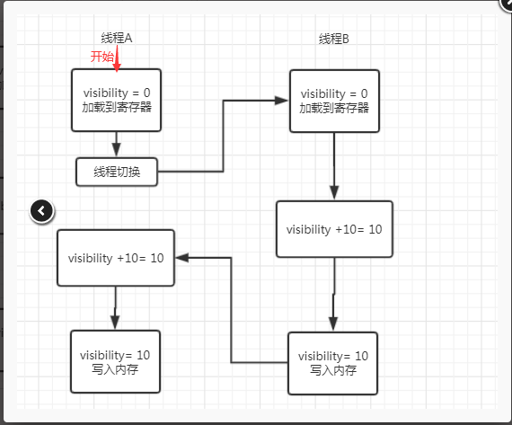

 # 原子性
 下面这段创建10个线程的方法是不安全的，原因是addcount 方法里面的 count ++ 不是线程安全的，也就不能保证整个创建的原子性
  
    while (i-- > 0) {
        new Thread(new Runnable() {
            public void run() {
                UnSafeCounter.addCount();
            }
        }).start();
    }
    
解决方法： 1.通过 synchronized关键字解决

    public static synchronized void addCount
    // synchronized 修饰方法，保证方法同一时间被一个线程获取
通过对addCount()方法用synchronized关键字修饰来实现加锁，这样线程在争夺执行权时必须要先获得锁,当线程获得锁后其他的线程都只能等待锁的释放，这样就保证了addCount操作的原子性。

2.也可以通过原子类型进行操作如：
    
    AtomicInteger、AtomicLong、AtomicReference
# 可见性
线程之间的可见性是指当一个线程修改一个变量，另外一个线程可以马上得到这个修改值
在很多场景下是需要这种可见性的，如银行交易等
NonVisibilityDemo这种场景
这个程序可能会一直循环下去，因为读线程可能读取不到写线程对于flag的写入而永远等待

为了保证线程间可见性我们一般有3种选择:

1. volatile:只保证可见性 VisibilityByVolatileDemo
2. Atomic相关类:保证可见性和原子性 VisibilityByAtomicDemo
3. Lock: 保证可见性和原子性 通过synchronized 给方法加锁

## 共享变量不可见的原因
可见性问题都是由Cpu缓存不一致为并发编程带来，而其中的主要有下面三种情况：

### 1. 线程交叉执行
线程交叉执行多数情况是由于线程切换导致的,例如下图中的线程A在执行过程中切换到线程B执行完成后，再切换回线程A执行剩下的操作；此时线程B对变量的修改不能对线程A立即可见，这就导致了计算结果和理想结果不一致的情况。

> 注意图中的寄存器代表高速缓存，CPU是与缓存打交道的，线程执行完毕的结果是放到内存中去的

###2. 重排序结合线程交叉执行

###3. 共享变量更新后的值没有在工作内存及主存间及时更新

