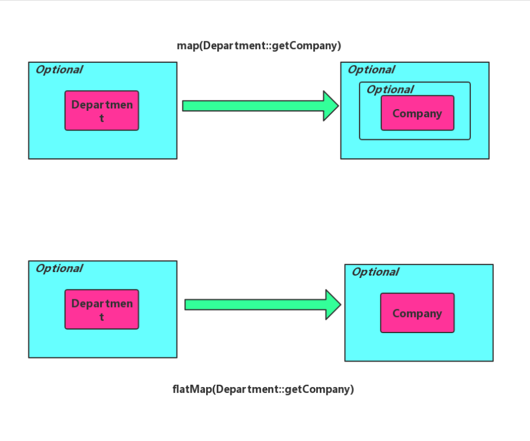

#NPE (NULL POINTER EXCEPTION)
对于一个新手来说，空指针是最应该关注的一个问题，也是迫切需要解决的问题
解决完这个问题之后，才能进行进阶，保证代码的健康性

常见就解决思路就是 加上判断如 

    if(Objects.isNull()){
        // todo
    }
    或
    if(StringUtils.isEmpty()){
        //to do
    }
  如果有多层对象嵌套的话，代码结构就变成这样了
  
      if(){
        if(){
            if(){
                ...
            }
        }
      }
代码可读性变得非常差，新手也要避免这种多层的if,解决思路 jdk1.8新工具类Optional 

## Optional API
Optional 三个创建方法如下：

    Optional.of(obj),如果对象为 null，将会抛出 NPE。
    Optional.ofNullable(obj),如果对象为 null,将会创建不包含值的 empty Optional 对象实例。
    Optional.empty() 等同于 Optional.ofNullable(null)
    
> 如果使用Optional.of 需要保证对象不能为null,使用时最好使用Optional.ofNullable

对象实例存入 Optional 容器中之后，最后我们需要从中取出。Optional#get 方法用于取出内部对象实例，不过需要注意的是，如果是 empty Optional 实例，由于容器内没有任何对象实例，使用 get 方法将会抛出 NoSuchElementException 异常。
为了防止异常抛出，可以使用 Optional#isPresent 。这个方法将会判断内部是否存在对象实例，若存在则返回 true。
    
    Optional<Company> optCompany = Optional.ofNullable(company);
    // 与直接使用空指针判断没有任何区别
    if (optCompany.isPresent()) {
        System.out.println(optCompany.get().getName());
    }
从上面可以看出，如果使用这个类只是用来判断空的话，和我们的if判断，并无区别

## 使用场景
    #1. Optional.ifPresent
    
    Company company = ...;
    if(company!=null){
        System.out.println(company);
    }
    改写成
    Optional<Company> optCompany = ...;
    optCompany.ifPresent(System.out::println);
    
    #2. Optional.filter
    if (company != null && "Apple".equals(company.getName())) {
        System.out.println("ok");
    }
    
    改写成
    Optional<Company> companyOpt=...;
    companyOpt
            .filter(company -> "Apple".equals(company.getName()))
            .ifPresent(company -> System.out.println("ok"));
    // filter 方法将会判断对象是否符合条件。如果不符合条件，将会返回一个空的 Optional

    3. Optional.orElse 与 Optional.orElseThrow
    
    String name = company != null ? company.getName() : "Unknown";
    
    if (company.getName() == null) {
        throw new RuntimeException();
    }
    
    改写成：
    // 设置默认值
    String name=companyOpt.orElse(new Company("Unknown")).getName();
    
    // 抛出异常
    String name=companyOpt.orElseThrow(RuntimeException::new).getName();
    
    4.Optional.map 与 Optional.flatMap
    Optional<Company> optCompany = ...;
    Optional<String> nameopt = optCompany.map(Company::getName);
  下面是两者区别
  