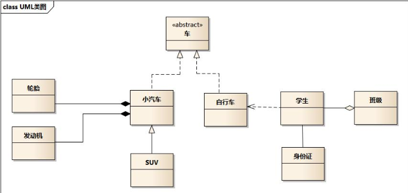
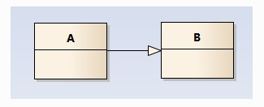
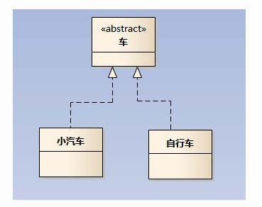
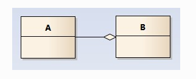
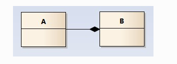
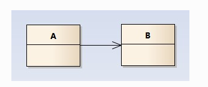
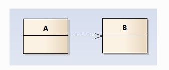

#UML类图
 

如上图所示，是一个UML类图，我们学习一下如何读取UML类图

可以看到小汽车，自行车都是车，和车是继承关系
SUV 是小汽车，SUV 和小汽车也是继承关系

##继承
继承通过is-a 判断，如上图描述的 小汽车是车，suv是小汽车都是这种模式

类的继承结构表现在UML中为：泛化(generalize)与实现(realize)

### 泛化
在UML图中，用带空心箭头的实现表示泛化

上例子中 suv 和小汽车之间就是继承泛化关系。代码中：泛化关系表现为继承非抽象类

###实现
实现关系用一条带空心箭头的虚线表示；

如上图所示，最终代码中，实现关系表现为继承抽象类（接口是特殊的抽象类，只有方法，且方法全部是抽象的）

## 聚合关系
聚合关系用一条带空心菱形箭头的直线表示，如下图表示A聚合到B上，或者说B由A组成；

代表由个体组合成的一个整体的概念，如学车组成班级

##组合关系
组合关系用一条带实心菱形箭头直线表示，如下图表示A组成B，或者B由A组成；

组合关系代表一种强烈的依赖关系，如部门和公司之间，公司不存在，部门肯定也就不存在，还有示例中的，汽车与 轮胎，发动机之间关系

> 聚合和组合之间区别: 很明显，组合代表的是一种组装强依赖关系，聚合只是代表的一种聚集效应。

##关联关系
关联关系是用一条直线表示的；它描述不同类的对象之间的结构关系；它是一种静态关系， 通常与运行状态无关，一般由常识等因素决定的；它一般用来定义对象之间静态的、天然的结构； 所以，关联关系是一种“强关联”的关系；

比如，乘车人和车票之间就是一种关联关系；学生和学校就是一种关联关系；

关联关系默认不强调方向，表示对象间相互知道；如果特别强调方向，如下图，表示A知道B，但 B不知道A；

在最终代码中，关联对象通常是以成员变量的形式实现的；

##依赖关系
依赖关系是用一套带箭头的虚线表示的；如下图表示A依赖于B；他描述一个对象在运行期间会用到另一个对象的关系；

